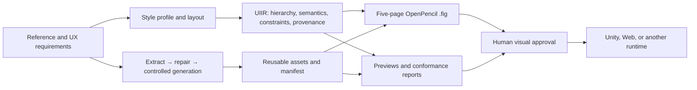

# UI Rebuilder

[简体中文](README.md) | [English](README.en.md)

UI Rebuilder is a project-agnostic game UI reconstruction pipeline. It turns a flattened UI reference, a style profile, and a layout description into an auditable `UIIR` intermediate representation, reusable raster assets, comparison previews, and an editable OpenPencil `.fig` design source.

> The current release produces a structurally complete five-page `.fig` package. Automatic OCR, automatic component inference, automatic matting, and direct Unity Prefab generation are not yet part of the core pipeline.

## Why UI Rebuilder

A screenshot-only recreation often flattens structure, art, text, and state back into another image. It also makes it difficult to tell whether an element was extracted from the source, repaired, or generated. UI Rebuilder separates those concerns:

- `UIIR` stores hierarchy, parent-relative geometry, semantics, style, and provenance;
- source-pixel extraction is preferred over deterministic repair, and controlled generation is the last option;
- text, values, progress, and states remain separate semantic nodes;
- panels, buttons, icons, and other visual assets become reusable components;
- input hashes, processing methods, dimensions, and review state are recorded for every build;
- design sources, asset manifests, previews, and quality reports are produced together for downstream Unity, Web, or other runtime integration.

## Implemented features

- JSON/YAML reconstruction jobs and portable style profiles;
- inline layouts or external layout-authority hierarchies;
- parent-relative UIIR hierarchy generation;
- deterministic source crops with SHA-256 provenance;
- transparent trimming, uniform scaling, nine-slice, tiling, target-size, and alpha checks;
- asset manifests, checkerboard contact sheets, and source overlays;
- OpenPencil native Frames, Text, Components, and Instances;
- five canonical pages: `00_Foundations`, `10_Wireframe`, `20_Visual`, `30_States`, and `90_Export`;
- UIIR-to-`.fig` coverage, geometry, embedded-image, and export-component conformance checks;
- consumer-font raster previews for headless CJK rendering while retaining editable Text nodes;
- project-local ComfyUI startup, model verification, and a controlled-generation workflow template;
- portable inventory, catalog, and recipe schemas.

## Workflow



The core rule is to keep `spec`, `inventory/catalog`, `recipe`, `UIIR`, and runtime `assembly` separate. A `.fig` file is an editable derivative of UIIR, not the only source of truth.

See the [full workflow](docs/workflow.en.md) and [architecture](docs/architecture.md) for details.

## Quick start

Requirements:

- Python 3.11 or newer;
- Git;
- Bun 1.3.5 for the initial OpenPencil installation;
- an NVIDIA GPU is optional for ComfyUI and is not required for `.fig` generation.

Install the core package:

```powershell
python -m venv .venv
.\.venv\Scripts\Activate.ps1
python -m pip install -e .
```

Install the project-local OpenPencil toolchain:

```powershell
python scripts/bootstrap.py --profile fig
ui-rebuilder doctor
```

The bootstrap script installs third-party source and the Bun runtime under the Git-ignored `third_party/` directory. They are not committed to the repository.

Run the redistributable example:

```powershell
python examples/minimal/create_reference.py
ui-rebuilder build examples/minimal/minimal.job.yaml --output Output/minimal --force
ui-rebuilder validate Output/minimal
```

The editable design is written to:

```text
Output/minimal/Design/minimal-public-example.fig
```

See the [getting-started guide](docs/getting-started.en.md) for full installation, local-tool import, and ComfyUI setup.

## Commands

```powershell
# Check the OpenPencil adapter
ui-rebuilder doctor

# Build UIIR, assets, previews, and .fig
ui-rebuilder build path\to\screen.job.yaml --output Output\screen

# Develop UIIR without OpenPencil
ui-rebuilder build path\to\screen.job.yaml --output Output\screen --skip-openpencil

# Validate an existing package
ui-rebuilder validate Output\screen
```

Non-empty output directories are protected by default. Use `--force` only when the existing output may be replaced.

## Parallel multi-project and multi-style builds

Use one `workspace.yaml` to declare consumer projects, allowed style profiles, and the task matrix:

```yaml
schemaVersion: 1
id: studio-workspace
outputRoot: Output
maxWorkers: 3
projects:
  - id: cultivation
    root: ../cultivation-project
    styles:
      - id: ink
        profile: design/styles/ink.json
      - id: dark
        profile: design/styles/dark.json
    tasks:
      - id: training
        job: design/jobs/training.job.yaml
        styles: [ink, dark]
```

```powershell
# Resolve the matrix and check paths/output collisions without building
ui-rebuilder workspace plan workspace.yaml

# Run up to three independent builds and validate every output
ui-rebuilder workspace build workspace.yaml --max-workers 3

# Revalidate all existing outputs
ui-rebuilder workspace validate workspace.yaml

# Select one project and style
ui-rebuilder workspace build workspace.yaml --project cultivation --style ink
```

The default output is `outputRoot/project/style/task`. Preflight requires unique project/task/style identifiers, requires the workspace style id to match the Style Profile id, and rejects duplicate outputs or paths escaping `outputRoot`. Every UIIR and build report records the workspace, project, style, task, and style hash.

A Style Profile constrains structured-node colors, typography, and spacing; it does not repaint pixels already extracted from the reference. Truly different panel, button, or icon art must come from style-specific assets/Catalogs or separate controlled-generation jobs.

See the runnable [multi-project example](examples/multi-project).

## Inputs

A reconstruction job normally contains:

```text
screen/
  reference.png       # flattened reference
  style.json          # color, spacing, typography, radius, and stroke constraints
  screen.job.yaml     # hierarchy, nodes, asset regions, and outputs
```

See [minimal.job.yaml](examples/minimal/minimal.job.yaml) and the [reconstruction job schema](schemas/reconstruction-job.schema.json). Relative paths are resolved from the job file directory.

## Outputs

| Path | Purpose |
| --- | --- |
| `uiir.json` | Canonical reconstruction representation |
| `asset-manifest.json` | Asset provenance, hashes, processing, and node bindings |
| `Assets/` | Extracted or deterministically processed raster assets |
| `Design/*.fig` | Editable OpenPencil design source |
| `Previews/` | Source overlay, page, and asset previews |
| `Reports/OpenPencil/` | Hierarchy, color, typography, spacing, overlap, lint, and completeness reports |
| `README.md` | Delivery notes for the generated package |

A build reports `complete-fig-pending-visual-approval` only after page structure, UIIR coverage, embedded assets, and geometry conformance pass. Structural completion is not art approval.

## Third-party tools

Downloaded source, models, runtimes, and caches live under the Git-ignored `third_party/` directory. The repository commits only:

- the [tool lock manifest](third_party/tools.lock.json);
- the [model manifest](third_party/models.lock.json);
- [third-party notices](THIRD_PARTY_NOTICES.md);
- reviewed compatibility patches.

Install the complete ComfyUI toolchain:

```powershell
python scripts/bootstrap.py --profile all --install-comfy-python
python scripts/verify_models.py --profile all
python scripts/run_comfyui.py
```

Model weights must be downloaded from the sources in the manifest and remain subject to their own terms. The project does not redistribute them.

## Scope boundaries

UI Rebuilder does not:

- decide gameplay or UX rules;
- approve a consumer project's art direction;
- infer every component semantic from pixels automatically;
- silently replace extracted pixels with generated candidates;
- modify consumer Unity scenes, Prefabs, or gameplay code directly.

The consumer project continues to own references, fonts, art direction, interaction contracts, final visual approval, and runtime implementation.

## Documentation

- [Getting started](docs/getting-started.en.md)
- [Full workflow](docs/workflow.en.md)
- [Architecture and boundaries](docs/architecture.md)
- [Migration roadmap](docs/migration.md)
- [Multi-project and multi-style example](examples/multi-project)
- [ComfyUI workflow](workflows/comfyui/README.md)
- [Third-party installation](third_party/README.md)
- [Public repository checklist](docs/publication.md)

## License

Original UI Rebuilder source is released under the [MIT License](LICENSE). Third-party tools, model weights, and generated content retain their own licenses; the MIT License does not relicense those external materials.
