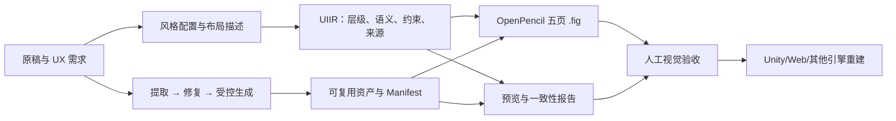

# UI Rebuilder

[简体中文](README.md) | [English](README.en.md)

UI Rebuilder 是一个与具体游戏项目解耦的游戏 UI 重建工具链。它把一张扁平化 UI 原稿、风格配置和布局描述转换为可审计的 `UIIR` 中间格式、可复用图片资产、对比预览，以及可继续编辑的 OpenPencil `.fig` 设计文件。

> 当前版本已经支持结构完整的五页 `.fig` 输出。自动 OCR、自动组件识别、自动抠图和直接生成 Unity Prefab 尚未纳入核心流水线。

## 它解决什么问题

传统的“看图重做 UI”容易把结构、图片、文字和状态重新压成一张图，也很难追踪某个元素究竟来自原稿提取、人工修复还是模型生成。UI Rebuilder 将这些职责拆开：

- 用 `UIIR` 保存父子层级、相对坐标、语义、样式和来源；
- 优先从原稿提取像素，再进行确定性修复，最后才进入受控生成；
- 将文字、数值、进度和状态保留为独立节点；
- 将面板、按钮、图标等资产输出为可复用组件；
- 为每次构建记录输入哈希、处理方式、尺寸和审核状态；
- 同时生成设计源、资产清单、预览图和质量报告，方便接入 Unity、Web 或其他运行时。

## 已实现功能

- 支持 JSON/YAML 重建任务和独立风格配置；
- 支持内联布局或外部 layout-authority 层级；
- 生成父节点相对坐标的 UIIR；
- 按区域提取原稿资产并记录 SHA-256 来源；
- 支持透明裁切、等比缩放、九宫格、平铺、目标尺寸和 Alpha 校验；
- 生成资产清单、棋盘格资产总览和原稿对齐预览；
- 输出 OpenPencil 原生 Frame、Text、Component 和 Instance；
- 输出 `00_Foundations`、`10_Wireframe`、`20_Visual`、`30_States`、`90_Export` 五个标准页面；
- 检查 UIIR 与 `.fig` 的节点覆盖、尺寸、嵌图数量和导出组件一致性；
- 支持消费项目提供字体时的中文栅格预览，同时保留可编辑 Text 节点；
- 提供 ComfyUI 本地启动、模型验证和受控生成工作流模板；
- 提供可移植的 inventory、catalog、recipe Schema。

## 工作流



核心原则是：`spec`、`inventory/catalog`、`recipe`、`UIIR` 和最终运行时 `assembly` 相互分离。`.fig` 是从 UIIR 派生的可编辑设计源，不是唯一事实来源。

详细流程见 [工作流程](docs/workflow.md)，数据边界见 [架构说明](docs/architecture.md)。

## 快速开始

环境要求：

- Python 3.11 或更高版本；
- Git；
- Bun 1.3.5，仅首次安装 OpenPencil 时需要；
- NVIDIA GPU 为 ComfyUI 可选要求，生成 `.fig` 本身不需要 GPU。

安装核心命令：

```powershell
python -m venv .venv
.\.venv\Scripts\Activate.ps1
python -m pip install -e .
```

安装项目内 OpenPencil 工具链：

```powershell
python scripts/bootstrap.py --profile fig
ui-rebuilder doctor
```

`bootstrap.py` 会把第三方源码和 Bun 运行时放入 Git 忽略的 `third_party/`，不会把它们加入仓库。

运行公开示例：

```powershell
python examples/minimal/create_reference.py
ui-rebuilder build examples/minimal/minimal.job.yaml --output Output/minimal --force
ui-rebuilder validate Output/minimal
```

生成的设计文件位于：

```text
Output/minimal/Design/minimal-public-example.fig
```

完整安装、已有本地工具迁移和 ComfyUI 配置见 [使用指南](docs/getting-started.md)。

## 基本命令

```powershell
# 检查 OpenPencil 适配器
ui-rebuilder doctor

# 构建 UIIR、资产包、预览和 .fig
ui-rebuilder build path\to\screen.job.yaml --output Output\screen

# 仅开发 UIIR，不调用 OpenPencil
ui-rebuilder build path\to\screen.job.yaml --output Output\screen --skip-openpencil

# 验证已有输出包
ui-rebuilder validate Output\screen
```

非空输出目录默认不会被覆盖；确认需要重建时使用 `--force`。

## 输入

一个任务通常包含：

```text
screen/
  reference.png       # 扁平化原稿
  style.json          # 颜色、间距、字体、圆角等风格约束
  screen.job.yaml     # 层级、节点、资产区域和输出要求
```

任务格式可参考 [minimal.job.yaml](examples/minimal/minimal.job.yaml) 和 [重建任务 Schema](schemas/reconstruction-job.schema.json)。路径相对于任务文件所在目录解析。

## 输出

| 路径 | 用途 |
| --- | --- |
| `uiir.json` | UI 重建的规范化中间格式 |
| `asset-manifest.json` | 资产、来源、哈希、处理方式和节点绑定 |
| `Assets/` | 提取或确定性处理后的独立图片 |
| `Design/*.fig` | OpenPencil 可编辑设计源 |
| `Previews/` | 原稿对齐、页面和资产预览 |
| `Reports/OpenPencil/` | 层级、颜色、字体、间距、重叠、Lint 和结构完整性报告 |
| `README.md` | 当前输出包的交付说明 |

只有当五页设计结构、节点覆盖、嵌入资产和几何一致性全部通过时，构建状态才会是 `complete-fig-pending-visual-approval`。它表示结构完成，仍不等于美术验收通过。

## 第三方工具

第三方源码、模型、运行时和缓存统一安装到 `third_party/`，并由 Git 忽略。仓库只提交：

- [工具锁定清单](third_party/tools.lock.json)；
- [模型清单](third_party/models.lock.json)；
- [第三方声明](THIRD_PARTY_NOTICES.md)；
- 经过审查的兼容补丁。

完整 ComfyUI 工具链：

```powershell
python scripts/bootstrap.py --profile all --install-comfy-python
python scripts/verify_models.py --profile all
python scripts/run_comfyui.py
```

模型需要按清单中的来源和许可条件手动下载。项目不会重新分发模型权重。

## 当前边界

UI Rebuilder 不负责：

- 决定游戏玩法或 UX 规则；
- 替消费项目批准美术风格；
- 自动判断所有像素中的组件语义；
- 静默用生成图片替换原稿提取结果；
- 直接修改消费项目的 Unity 场景、Prefab 或业务代码。

消费项目继续拥有原稿、字体、品牌/美术规范、交互契约、最终视觉验收和引擎实现。

## 文档

- [使用指南](docs/getting-started.md)
- [完整工作流程](docs/workflow.md)
- [架构与数据边界](docs/architecture.md)
- [后续迁移计划](docs/migration.md)
- [ComfyUI 工作流](workflows/comfyui/README.md)
- [第三方安装与目录](third_party/README.md)
- [公开仓库检查清单](docs/publication.md)

## 许可证

UI Rebuilder 自有源码以 [MIT License](LICENSE) 发布。第三方工具、模型和生成内容分别遵循其自身许可证；MIT License 不会覆盖这些外部内容。
